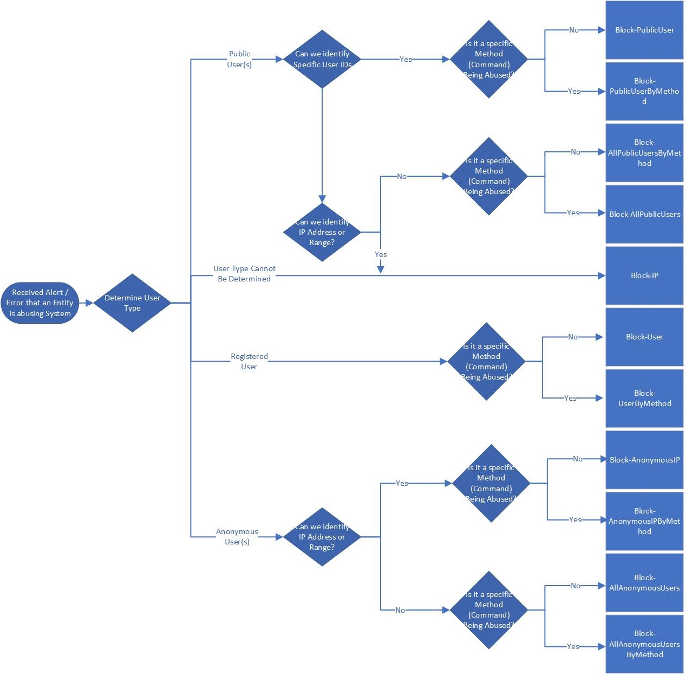

# Table of contents
1. [Deep links](/Team-Pages/Search-and-Social/VS.In-Social/Wiki-edit-capabilities-(Markdown)/Links/Deep-links#introduction)
2. [Wiki home page](#wiki-home-page)
3. [Simplified edit experience](#simplified-edit-experience)
4. [Review your page history ](#review-your-page-history)
5. [Contribute](#contribute)

 # Introduction

VSTS now supports its very own Wiki (preview) with a rich set of capabilities. Wiki is a great collaboration platform that will make it easy for teams to create and maintain project and process documentation in a simplified manner.

The Wiki experience hosts the following key features.

## Wiki home page
- Content pane on the left shows rich preview of a Wiki page written in [markdown](https://www.visualstudio.com/en-us/docs/reference/markdown-guidance) along with the editor and edit time
 

## Simplified edit experience
- Supports rich content editing experience using markdown 
- Side by side preview experience
- Format pane that allows users to conveniently format markdown pages
 

## Review your page history 
- See revisions for a page along with the author, the revision message, and the last updated time for a particular revision.

- Click on any of the revisions to understanding what changes were made to a revision.

# Contribute

1. Look at our [backlog](https://mseng.visualstudio.com/VSOnline/VS.in%20VCX%20Agile/_backlogs/board/Features) to see what is coming up next in Wiki. 
2. If you have additional feedback on making Wiki better then please share your feedback using the VSTS smiley or simply drop us an email "VS.in Social Leads & PMs" <VSinSocialLeaders@>;
3. Do you want to make this page better, simply edit and take a shot. It's that easy!! :)

